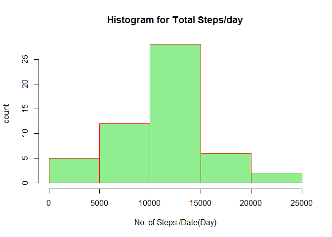
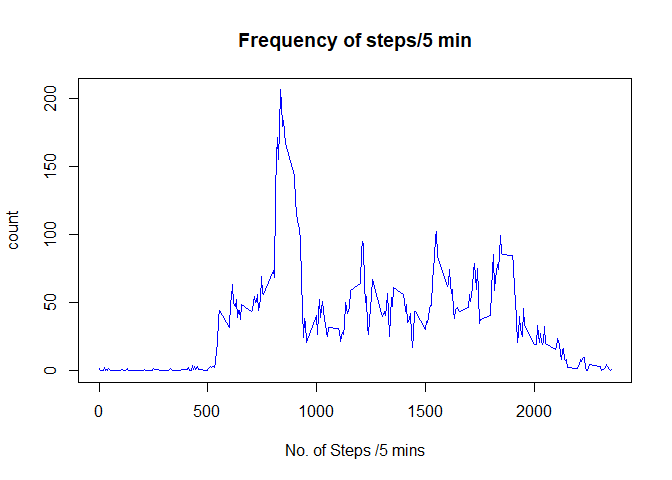
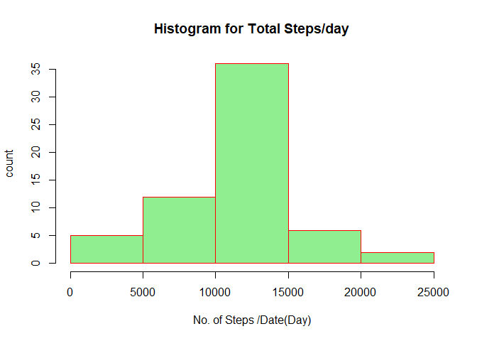
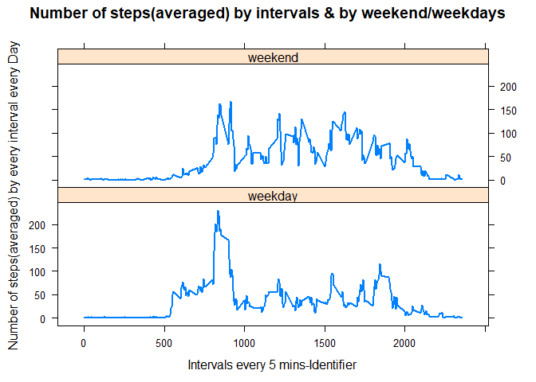

### Reproducable Research Assignment1

### the document builds up the answers to Questions in Assignment1 step by step

#### Loading and preprocessing the data

#### Show any code that is needed to Load the data (i.e. read.csv())

    ##Read the data
    StepsData<-read.table("activity.csv",header=TRUE,sep=",")
    ##check the data
    head(StepsData)

    ##   steps       date interval
    ## 1    NA 2012-10-01        0
    ## 2    NA 2012-10-01        5
    ## 3    NA 2012-10-01       10
    ## 4    NA 2012-10-01       15
    ## 5    NA 2012-10-01       20
    ## 6    NA 2012-10-01       25

### Q1.What is mean total number of steps taken per day?For this part of the assignment, you can ignore the missing values in the dataset.

##### 1.Calculate the total number of steps taken per day

    library(dplyr)
    ##consider the cases without NA
    StepsData_noNA<-StepsData[complete.cases(StepsData),]
    head(StepsData_noNA)

    ##     steps       date interval
    ## 289     0 2012-10-02        0
    ## 290     0 2012-10-02        5
    ## 291     0 2012-10-02       10
    ## 292     0 2012-10-02       15
    ## 293     0 2012-10-02       20
    ## 294     0 2012-10-02       25

    ##Table the sum total steps taken per day
    StepsDay_Sum<-aggregate(steps~date,StepsData_noNA,sum)
    head(StepsDay_Sum)

    ##         date steps
    ## 1 2012-10-02   126
    ## 2 2012-10-03 11352
    ## 3 2012-10-04 12116
    ## 4 2012-10-05 13294
    ## 5 2012-10-06 15420
    ## 6 2012-10-07 11015

##### 2.If you do not understand the difference between a histogram and a barplot, research the difference between them. Make a histogram of the total number of steps taken each day

    ##Make a histogram of the total number of steps taken each day
    hist(StepsDay_Sum$steps,xlab="No. of Steps /Date(Day)",ylab="count",col="light green",border="red",main="Histogram for Total Steps/day")

##### 3.Calculate and report the mean and median of the total number of steps taken per day

    ##Report the mean and median of the Data
    mean(StepsDay_Sum$steps)

    ## [1] 10766.19

    median(StepsDay_Sum$steps)

    ## [1] 10765

### Q2.What is the average daily activity pattern?

##### 1.Make a time series plot (i.e. type = "l") of the 5-minute interval (x-axis) and the average number of steps taken, averaged across all days (y-axis)

    avg_5min<-aggregate(steps~interval,StepsData_noNA,mean)
    ##check the average 5 min steps data set
    head(avg_5min)

    ##   interval     steps
    ## 1        0 1.7169811
    ## 2        5 0.3396226
    ## 3       10 0.1320755
    ## 4       15 0.1509434
    ## 5       20 0.0754717
    ## 6       25 2.0943396

    plot(avg_5min$interval,avg_5min$steps,type="l",col="blue",xlab = "No. of Steps /5 mins",ylab = "count",main = "Frequency of steps/5 min")

##### 2.Which 5-minute interval, on average across all the days in the dataset, contains the maximum number of steps?

    ##the interval which has maximum no of steps and the step count
    MaxInterval<-avg_5min[which.max(avg_5min$steps),]
    MaxInterval

    ##     interval    steps
    ## 104      835 206.1698

### Q3.Imputing missing values

Note that there are a number of days/intervals where there are missing
values (coded as NA). The presence of missing days may introduce bias
into some calculations or summaries of the data.

##### 1.Calculate and report the total number of missing values in the dataset (i.e. the total number of rows with NAs)

    ##the total no. of missing values in the activity dataset
    sum(is.na(StepsData$steps))

    ## [1] 2304

##### 2.Devise a strategy for filling in all of the missing values in the dataset. The strategy does not need to be sophisticated. For example, you could use the mean/median for that day, or the mean for that 5-minute interval, etc.

#### the strategy used here is that the NA values are replaced with the average value of the corresponding Interval as calculated over all the years as in the table "avg\_5min" above

##### 3.Create a new dataset that is equal to the original dataset but with the missing data filled in.

    ##define the imputed dataset as the main activity data at the outset
    imputedStepsData <- StepsData 
    for (i in avg_5min$interval) {
    IntervalChosen<-avg_5min$steps[avg_5min$interval == i]
      
      imputedStepsData[imputedStepsData$interval == i & is.na(imputedStepsData$steps), ]$steps <- IntervalChosen
    }
    ##check the imputed data set
    head(imputedStepsData)

    ##       steps       date interval
    ## 1 1.7169811 2012-10-01        0
    ## 2 0.3396226 2012-10-01        5
    ## 3 0.1320755 2012-10-01       10
    ## 4 0.1509434 2012-10-01       15
    ## 5 0.0754717 2012-10-01       20
    ## 6 2.0943396 2012-10-01       25

    tail(imputedStepsData)

    ##           steps       date interval
    ## 17563 2.6037736 2012-11-30     2330
    ## 17564 4.6981132 2012-11-30     2335
    ## 17565 3.3018868 2012-11-30     2340
    ## 17566 0.6415094 2012-11-30     2345
    ## 17567 0.2264151 2012-11-30     2350
    ## 17568 1.0754717 2012-11-30     2355

##### 4.Make a histogram of the total number of steps taken each day and Calculate and report the mean and median total number of steps taken per day. Do these values differ from the estimates from the first part of the assignment? What is the impact of imputing missing data on the estimates of the total daily number of steps?

    ##Make a histogram of the total number of steps taken each day

    imputedStepsData_Sum<-aggregate(steps~date,imputedStepsData,sum)
    hist(imputedStepsData_Sum$steps,xlab="No. of Steps /Date(Day)",ylab="count",col="light green",border="red",main="Histogram for Total Steps/day")

    mean(StepsDay_Sum$steps)#####mean with the original Activity data with NAs

    ## [1] 10766.19

    median(StepsDay_Sum$steps)#####median with the original Activity data with NAs

    ## [1] 10765

    mean(imputedStepsData_Sum$steps)#####mean with the Imputed Activity data without NAs

    ## [1] 10766.19

    median(imputedStepsData_Sum$steps)#####median with the Imputed Activity data without NAs

    ## [1] 10766.19

    #####difference in mean
    paste(((mean(imputedStepsData_Sum$steps)-mean(StepsDay_Sum$steps))/mean(StepsDay_Sum$steps))*100,"%")

    ## [1] "0 %"

    #####difference in median
    paste(((median(imputedStepsData_Sum$steps)-median(StepsDay_Sum$steps))/median(StepsDay_Sum$steps))*100,"%")

    ## [1] "0.0110420738066178 %"

### Q4.Are there differences in activity patterns between weekdays and weekends?

    For this part the weekdays() function may be of some help here. Use the dataset with the filled-in  missing values for       this part.

##### 1.Create a new factor variable in the dataset with two levels - "weekday" and "weekend" indicating whether a given date is a weekday or weekend day.

    ##new variable called imputedStepsData_wkday_wkend with daytype column
    imputedStepsData_wkday_wkend<-imputedStepsData###set to last dataset at the outset

    ###convert date column to Date 
    imputedStepsData_wkday_wkend$date<-as.Date(imputedStepsData_wkday_wkend$date)

    ###add a new column with daytype defined
    imputedStepsData_wkday_wkend<-data.frame(imputedStepsData_wkday_wkend,daytype=weekdays(imputedStepsData_wkday_wkend$date))

    ###change levels of daytype to weekday or weekend
    levels(imputedStepsData_wkday_wkend$daytype)<-c(rep("weekday",2),rep("weekend",2),rep("weekday",3))
    head(imputedStepsData_wkday_wkend)

    ##       steps       date interval daytype
    ## 1 1.7169811 2012-10-01        0 weekday
    ## 2 0.3396226 2012-10-01        5 weekday
    ## 3 0.1320755 2012-10-01       10 weekday
    ## 4 0.1509434 2012-10-01       15 weekday
    ## 5 0.0754717 2012-10-01       20 weekday
    ## 6 2.0943396 2012-10-01       25 weekday

##### 2.Make a panel plot containing a time series plot (i.e. type = "l") of the 5-minute interval (x-axis) and the average number of steps taken, averaged across all weekday days or weekend days (y-axis). See the README file in the GitHub repository to see an example of what this plot should look like using simulated data.

    ##call the lattice library
    library(lattice)
    ##calulate the average no of steps per interval per day(weekday or weekend)
    avg_step_wkday_wkend <- aggregate(steps ~ interval + daytype, data = imputedStepsData_wkday_wkend, mean)

    ##plot the lattice curve
    xyplot(steps ~ interval | daytype, data = avg_step_wkday_wkend, type = "l", lwd = 2,layout = c(1, 2), xlab = "Intervals every 5 mins-Identifier", ylab = "Number of steps(averaged) by every interval every Day",
    main = "Number of steps(averaged) by intervals & by weekend/weekdays")

